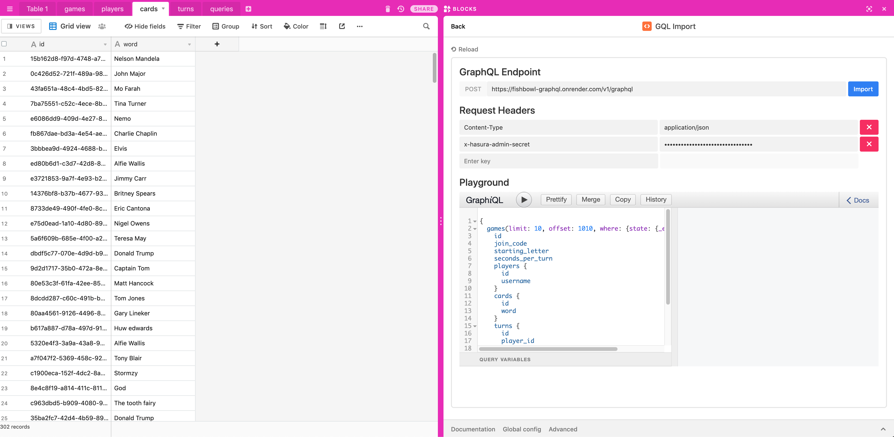

# Custom Block To Import Data via GraphQL

[Demo Video!](https://www.youtube.com/watch?v=837DKJq-FAs&feature=youtu.be)

Features
- hit any GraphQL endpoint over http with any headers, which are synced to local storage for easier, repeated use
- explore your data via GraphiQL interface. Access to historical queries, docs, etc. 
- import the data via a step-by-step wizard that helps you visualize tables and records that will be created
- identifies field conflicts on existing tables
- logs all queries made when importing in historical `queries` table

Future
- feedback! and bug bashing!
- disable import button if not editor/collaborator (has permission to create table/insert records)
- schema discovery based on parsing the query vs. parsing a sample of the data
- support for non-array (object) nestings in the graph
- better types that match the GraphQL schema (not just "single line text" for all fields)
- improve error handling / error messaging for the end user
- support for Relays spec (nodes, edges, etc.)

Screenshots


---


---



# Local development

1. Clone the repo

```
git clone git@github.com:avimoondra/airtable-block-graphql-import.git
```

2. Install Airtable Blocks CLI

```
npm install -g @airtable/blocks-cli
```

3. Update `.block/remote.json` to match your installation

4. Install dependencies

```
cd airtable-block-graphql-import
npm install
```

5. Run!

```
block run
```
